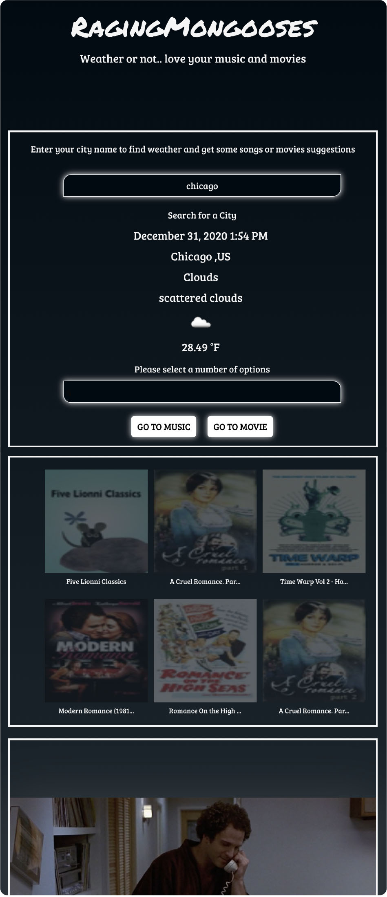

# Project 1

## Deployed Website
#### [project7_group-1](https://oliviapark113.github.io/project7_group-1/.)

#### CONCEPT 
* Using 2 different API to incorprate one APP

#### DESCRIPTION: 
* User searches weather on user's area, based on weather data of user's area App suggest best music, movie information to users. 

#### MOTIVATION: 
* Discover new music and movie to enhance users feeling.

#### User Story: 
* As a user, I want to recieve current weather with music and/or movie recommended to me based on current weather. 

## TECHNOLOGIES to use:
#### API 
* Music & Movie data 
[itunes.apple.com](https://affiliate.itunes.apple.com/resources/documentationitunes-store-web-service-search-api/)

* Weather data 
[openweathermap.org](https://openweathermap.org/api
)

#### CSS FRAMEWORK 
* CSS Layout 
[Foundation](https://get.foundation/)

#### COLOR/Gradient effect
* COLORS
[material.io](https://material.io/resources/color/
)
* Background Gradient colors 
[CSSgradient.io](https://cssgradient.io/)

#### FONTS 

* Typography
[Googlefonts](https://fonts.google.com/)

#### Task & Role 
* Front-end developer:
_Michael Rosa-Vourazeris_
_Kristina al-ashqar_

* Back end developer:
_Olivia, Youngmee, Park_
_Paul Nuguyen_

#### Our challenges & Sucess Story
###### Challenge:

* GitHub: 
Cors error in Git hub deployed link, Github access.
(resolustion: ```https//cors-anywhere.herokuapp.com/``` adding in front of url.
[Handle CORS Client-side](https://gist.github.com/jesperorb/6ca596217c8dfba237744966c2b5ab1e))
_Front end part:_ 
get familiar with using new frame work , responsive layout.
_Back end part :_ 
Combine separate data of arrays into one master array 
(resolution- await ajax with async function) 
Separate music and movie data from one master array 
(resolution- set musicMaterList and movieMasterList as 2 global empty array variables and push music and movie data separately)

##### Success: 
Working with teammates and resolve function issues and layout issues and build app together. 

#### Original Layout


#### Actual APP view 
##### 1.When open pages .. User enter city data input area. 


##### 2.Then user will recieve the current weather data , select number of data and choose button for music or movie


##### 3.Then recieve recommended data per number of selection. 


##### 4.Then click images to view video.

##### once video starts playing image sections gets blur . once finished user click "CLOSE" button to end video.

##### 5.App is Resposive
